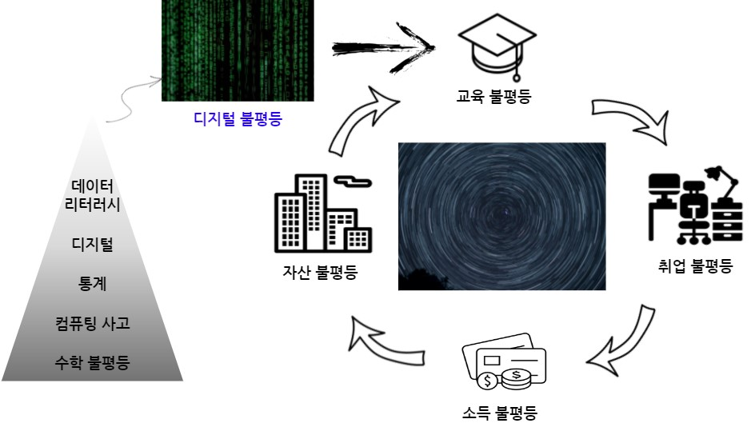
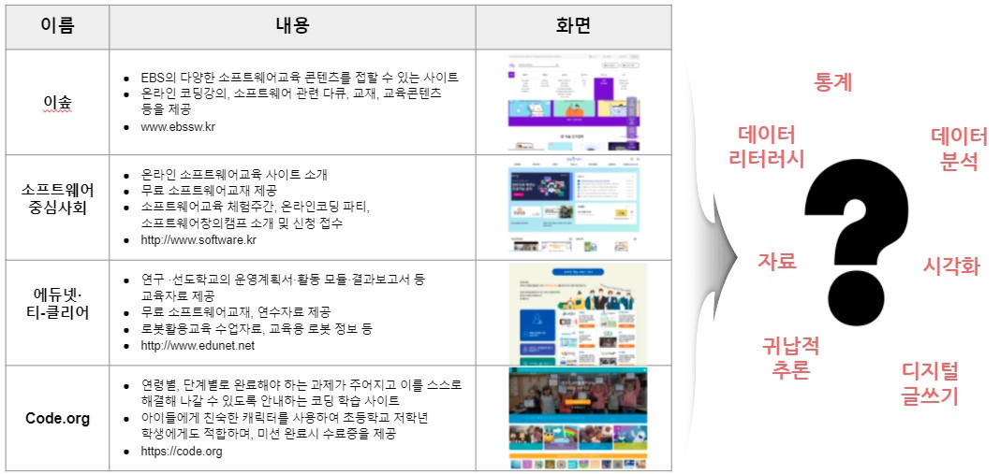
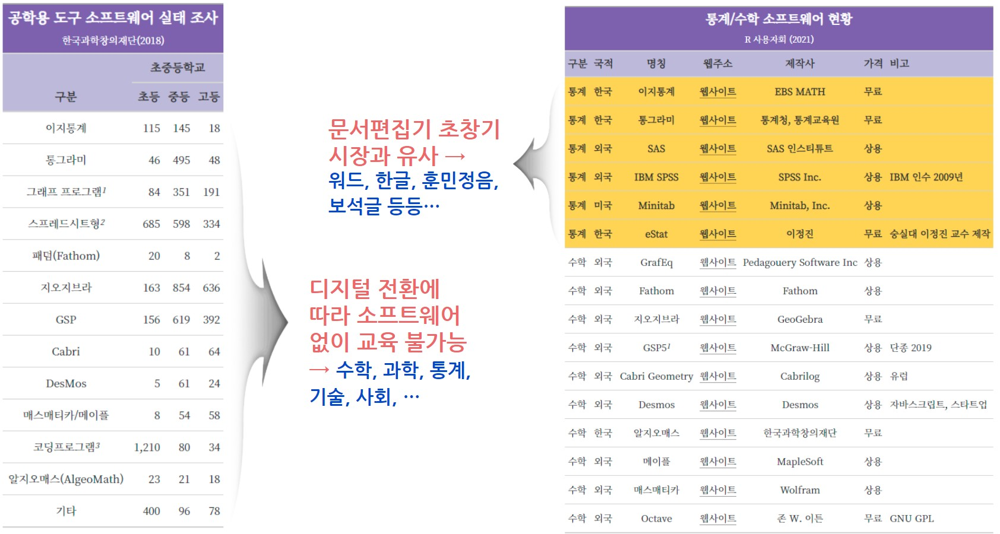

---
name: openstat-intro
# 디지털 불평등

.center[

]


.footnote[
- [국산 오픈 통계 패키지 - 초중등 교육용 통계 패키지](https://docs.google.com/presentation/d/1v5gu8pTHMcRUei8II4eGB5367fGRZJlRzML9v0U9QdE/)
]

---
name: rconf-onboarding-digital-divide
# 데이터 리터러시 교육(?)

<br>

.center[

]


.footnote[
- 국회입법조사처 "초중등 소프트웨어 교육 운영실태와 개선과제" 2019.12. 제34호
]

---
name: rconf-onboarding-now
# 데이터 리터러시 교육(?)

<br>

.center[

]


.footnote[
- 국회입법조사처 "초중등 소프트웨어 교육 운영실태와 개선과제" 2019.12. 제34호
]

---
name: rconf-onboarding-stat
# 통계/수학 SW 현황 (R사용자회, 2021)


```{r engineering-software}
library(tidyverse)
library(gt)

eng_tbl <- tribble(~"구분", ~"국적", ~"명칭", ~"웹주소", ~"제작사", ~"가격", ~"비고",
                  "통계", "한국", "이지통계", "https://ebsmath.co.kr/easyTong", "EBS MATH", "무료", "",
                  "통계",  "한국", "통그라미", "https://tong.kostat.go.kr/", "통계청, 통계교육원", "무료", "",
                  "수학", "외국", "GrafEq", "http://www.peda.com/", "Pedagouery Software Inc", "상용", "",
                  "수학",  "외국", "Fathom", "https://www.fathomhq.com/", "Fathom", "상용", "",
                  "수학",  "외국",  "지오지브라", "https://www.geogebra.org/", "GeoGebra", "무료", "",
                  "수학",  "외국",  "GSP5", "https://www.dynamicgeometry.com/", "McGraw-Hill", "상용", "단종 2019",
                  "수학",  "외국",  "Cabri Geometry", "https://www.cabri.com/en/", "Cabrilog", "상용", "유럽",
                  "수학",  "외국",  "Desmos", "https://www.desmos.com/", "Desmos", "상용", "자바스크립트, 스타트업",
                  "수학",  "한국", "알지오매스", "https://www.algeomath.kr/", "한국과학창의재단", "무료",  "",
                  "수학",  "외국",  "메이플", "https://www.maplesoft.com/products/maple/", "MapleSoft", "상용",  "",
                  "수학",  "외국",  "매스매티카", "https://www.wolfram.com/mathematica/", "Wolfram", "상용", "",
                  "수학",  "외국",  "Octave", "https://www.gnu.org/software/octave/", "존 W. 이튼", "무료", "GNU GPL",
                  "통계", "외국", "SAS", "https://www.sas.com/ko_kr/home.html", "SAS 인스티튜트", "상용", "",
                  "통계", "외국", "IBM SPSS", "https://www.ibm.com/products/spss-statistics", "SPSS Inc.", "상용", "IBM 인수 2009년",
                  "통계", "미국", "Minitab", "https://www.minitab.com/ko-kr/", "Minitab, Inc.", "상용", "",
                  "통계", "한국", "eStat", "http://estat.me/", "이정진", "무료", "숭실대 이정진 교수 제작")

eng_tbl_gt <- eng_tbl %>% 
  mutate(
    웹주소 = map(웹주소, ~ htmltools::a(href = .x, "웹사이트")),
    웹주소 = map(웹주소, ~ gt::html(as.character(.x)))) %>% 
  arrange(desc(구분)) %>% 
  gt() %>% 
    cols_align(
      align = "center",
      columns = c(명칭, 제작사)
  ) %>% 
  tab_options(
    heading.background.color = "#756bb1",
    column_labels.background.color = "#bcbddc",
    column_labels.font.weight = "bold",
    stub.background.color = "#bcbddc",
    stub.font.weight = "bold",
    table.font.size = px(15L),
    data_row.padding = px(0)
  ) %>% 
  tab_style(
    style = list(
      cell_fill(color = "#f5cb42"),
      cell_text(weight = "bold")
      ),
    locations = cells_body(
      rows = 구분 == '통계')
  ) %>% 
  tab_footnote(
    locations = cells_body(columns = 명칭, rows = 명칭 == "GSP5"),
    footnote = md("GSP5: Geometer’s Sketchpad")
  )

eng_tbl_gt
```


---
name: rconf-onboarding-now
# 통계/데이터 리터리시 교육 현재

<br>

.center[

]

.footnote[
- [Open UP On-Boarding - `Tidyverse Korea`](https://r2bit.com/onboard/tong.html)
]
