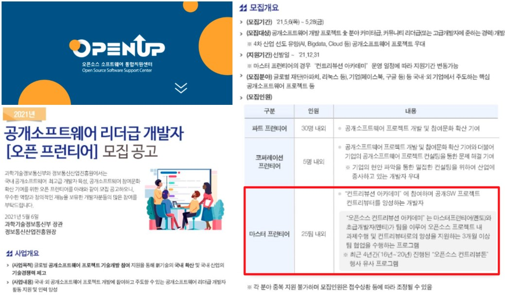
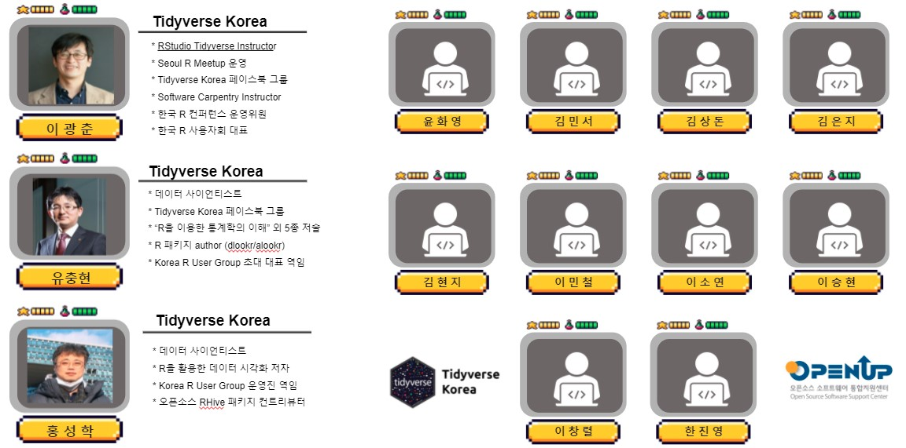

---
class: inverse, middle
name: openstat-openup

# 발표 개요

----

.pull-left[

.black[**통계 초보자 및 일반인**]이 쉽게 사용할 수 있도록 .warmyellow[**데이터를 입력하면 자동으로 데이터를 인식하여 최적의 분석을 실행**]하고 결과물도 PDF, HTML, 워드, 대쉬보드 재현가능하게 자동생성되고, 스프레드쉬트 계열의 정형데이터를 넘어 다양한 비정형 데이터(시계열, 공간지리, 텍스트, 이미지 등)도 처리할 수 있도록 데이터 가져오기(auto-Ingest), 탐색적 분석(auto-EDA), 모형(auto-ML), 시각화(auto-Viz), 표(auto-Table), 보고서(auto-Report) 영역에 .green[**Auto-X 기술**]을 적용하여 클라우드 SaaS 기반 통계 패키지 SW 개발.

]
 
.pull-right[   
.left[

1\. [들어가며](#openstat-intro)

2\. **[.warmyellow[오픈업 컨트리뷰션]](#openstat-openup)**

3\. [On-Boarding 프로그램](#openstat-onboarding)

4\. [오픈 통계 패키지](#openstat-openstat)
 
5\. [마무리](#openstat-goodbye)

]
] <!--end of right-column-->

---
name: openstat-openup-start
# Open UP 오픈 프런티어 - Tidyverse Korea

.center[

]

.footnote[
- [[컨트리뷰톤]2021년 Open UP 오픈 프런티어 「마스터 프런티어」 프로젝트팀 선정결과 안내](https://www.oss.kr/notice/show/612cc49e-08b2-486f-83d6-ac7f4114f0d5)
]

---
name: rconf-openup-members
# Open UP 마스터즈 프로그램 - 멘토/멘티

 

.center[

]

