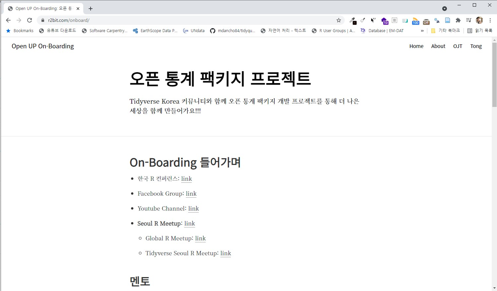
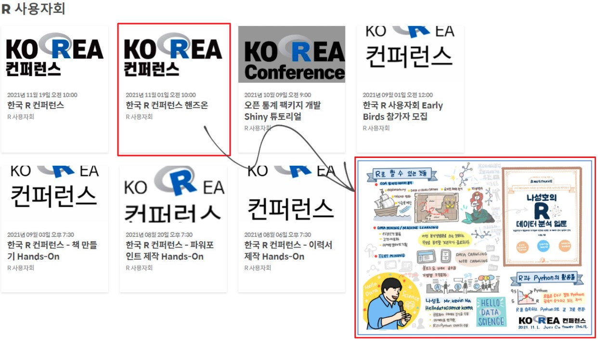
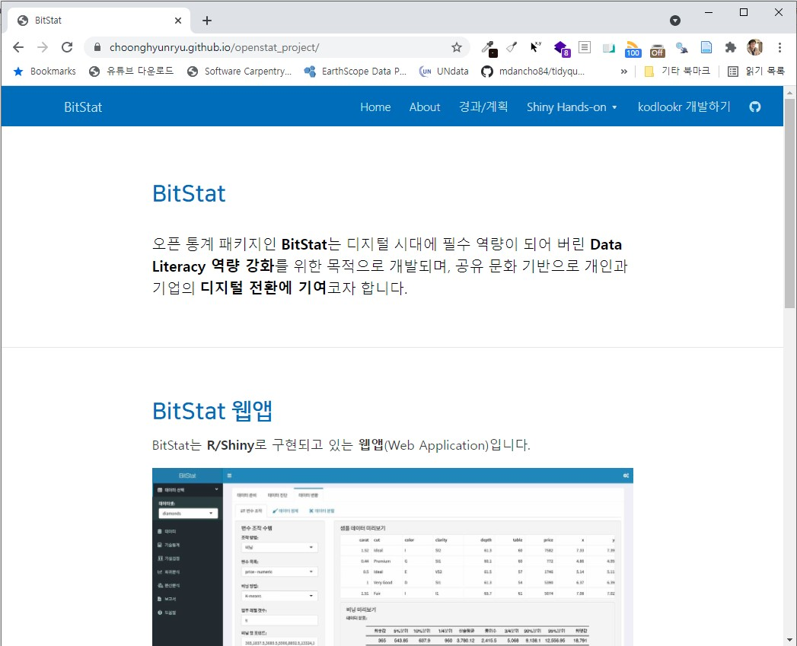

---
class: inverse, middle
name: openstat-onboarding

# 발표 개요

----

.pull-left[

.black[**통계 초보자 및 일반인**]이 쉽게 사용할 수 있도록 .warmyellow[**데이터를 입력하면 자동으로 데이터를 인식하여 최적의 분석을 실행**]하고 결과물도 PDF, HTML, 워드, 대쉬보드 재현가능하게 자동생성되고, 스프레드쉬트 계열의 정형데이터를 넘어 다양한 비정형 데이터(시계열, 공간지리, 텍스트, 이미지 등)도 처리할 수 있도록 데이터 가져오기(auto-Ingest), 탐색적 분석(auto-EDA), 모형(auto-ML), 시각화(auto-Viz), 표(auto-Table), 보고서(auto-Report) 영역에 .green[**Auto-X 기술**]을 적용하여 클라우드 SaaS 기반 통계 패키지 SW 개발.

]
 
.pull-right[   
.left[

1\. [들어가며](#openstat-intro)

2\. [오픈업 컨트리뷰션](#openstat-openup)

3\. **[.warmyellow[On-Boarding 프로그램]](#openstat-onboarding)**

4\. [오픈 통계 패키지](#openstat-openstat)
 
5\. [마무리](#openstat-goodbye)

]
] <!--end of right-column-->

---
name: openstat-onboarding-start
# 한국 R 커뮤니티 소개 (글로벌 네트워크)

- R Conference and Meetings: [link](https://jumpingrivers.github.io/meetingsR/r-user-groups.html)
- AsiaR Conference & Asia R Meetup(회의록): [link](https://hackmd.io/QmR_Z8_ERauMk3YekUbsxQ)
- 한국 R 컨퍼런스: [link](https://use-r.kr/), [Virtual Events](https://jumpingrivers.github.io/meetingsR/virtual-events.html)
- Facebook Group: [link](https://www.facebook.com/groups/tidyverse)
- Youtube Channel: [link](https://www.youtube.com/channel/UCW-epmIvjBEhhVXw_F0Nqbw)
- **Seoul R Meetup**: [link](https://www.meetup.com/seoul-r-meetup)
  - Global R Meetup: [link](https://benubah.github.io/r-community-explorer/rugs.html)
  - Tidyverse Seoul R Meetup: [link](https://tidyverse-korea.github.io/seoul-R/)
- **로고** &larr; [데이콘](https://dacon.io/)

.pull-left[

]

.pull-right[

]

.footnote[
- [Open UP On-Boarding - `Tidyverse Korea` 오픈 통계 패키지](https://r2bit.com/onboard/)
]

---
name: rconf-onboarding
# 오픈업 위한 On-Boarding 프로그램

.center[

]

.footnote[
- [Open UP On-Boarding - `Tidyverse Korea` 오픈 통계 패키지](https://r2bit.com/onboard/)
]

---
name: rconf-onboarding-virtual
# R 핸즈온(Hands-on)

 

.center[

]

.footnote[
- [FESTA.IO - 한국 R 컨퍼런스 핸즈온](https://festa.io/hosts/1099/)
]

---
name: rconf-onboarding-openstat
# 오픈통계 패키지 개발 튜토리얼

.center[

]

.footnote[
- [BitStat - R/Shiny 튜토리얼](https://choonghyunryu.github.io/openstat_project/)
]

