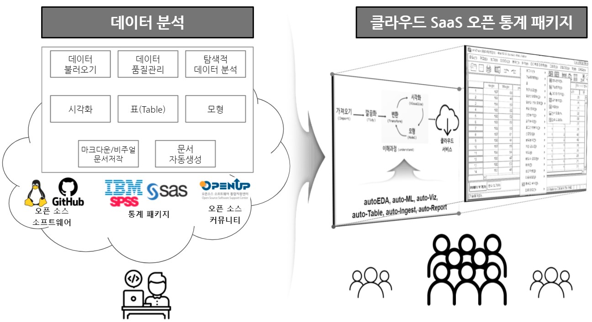
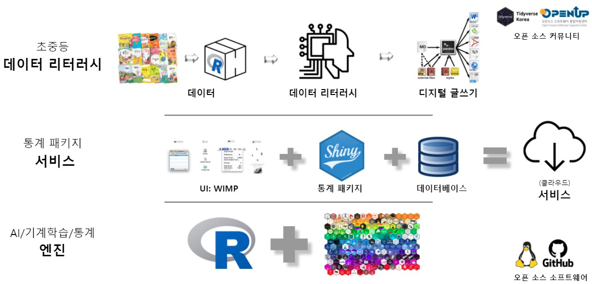
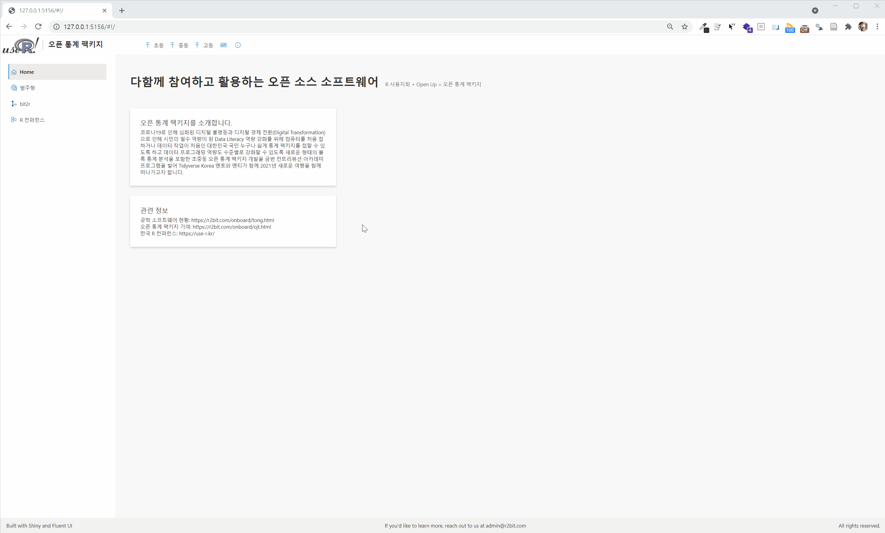

---
class: inverse, middle
name: openstat-openstat

# 발표 개요

----

.pull-left[

.black[**통계 초보자 및 일반인**]이 쉽게 사용할 수 있도록 .warmyellow[**데이터를 입력하면 자동으로 데이터를 인식하여 최적의 분석을 실행**]하고 결과물도 PDF, HTML, 워드, 대쉬보드 재현가능하게 자동생성되고, 스프레드쉬트 계열의 정형데이터를 넘어 다양한 비정형 데이터(시계열, 공간지리, 텍스트, 이미지 등)도 처리할 수 있도록 데이터 가져오기(auto-Ingest), 탐색적 분석(auto-EDA), 모형(auto-ML), 시각화(auto-Viz), 표(auto-Table), 보고서(auto-Report) 영역에 .green[**Auto-X 기술**]을 적용하여 클라우드 SaaS 기반 통계 패키지 SW 개발.

]
 
.pull-right[   
.left[

1\. [들어가며](#openstat-intro)

2\. [오픈업 컨트리뷰션](#openstat-openup)

3\. [On-Boarding 프로그램](#openstat-onboarding)

4\. **[.warmyellow[오픈 통계 패키지]](#openstat-openstat)**
 
5\. [마무리](#openstat-goodbye)

]
] <!--end of right-column-->

---
name: openstat-openstat-start
# 오픈통계 패키지 - 통계 분석 대중화

 

.center[

]

.footnote[
- [Derek Wang (2021-04-21), "Four Steps To Data Democratization With Artificial Intelligence", Forbes](https://www.forbes.com/sites/forbestechcouncil/2021/04/21/four-steps-to-data-democratization-with-artificial-intelligence/?sh=59158f8979a0)
]

---
name: rconf-openstat-birdseye
# 오픈통계 패키지 - Birds-eye View

 

.center[

]

.footnote[
- 출처: R 사용자회
]

---
name: rconf-openstat-statdata
# 오픈통계 패키지 - 데이터 패키지(`statdata`)

.pull-right[

]

.footnote[
- [GitHub 저장소](https://github.com/tidyverse-korea/statdata), [`statdata` 웹사이트](https://tidyverse-korea.github.io/statdata/) [eStat](http://estat.me/estat/eStat/) 
]

---
name: rconf-openstat-ui
# 오픈통계 패키지 - UI (`Shiny.fluent`)

.footnote[
- [제작방법](https://statkclee.github.io/data-product/open-stat-module-gender.html)
]

---
name: rconf-openstat-bitstat
# 오픈통계 패키지 - `BitStat`

 

.footnote[
- [`BitStat`: GitHub 저장소](https://github.com/bit2r/BitStat) 
]

---
name: rconf-openstat-wanted
# 오픈통계 패키지 - 컨트리뷰터 함께 해요!!!

.footnote[
- 이미지 출처: Clayton Cardinalli from Unsplash.
]

